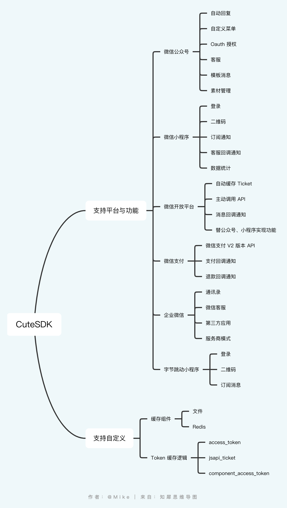

# CutesSDK

## 使用说明

- 安装 SDK

```shell
go get -u github.com/cutesdk-go/cutesdk
```

- SDK 子包

| 子包名称    |  import 路径   |  说明   |
| --- | --- | --- |
|  wxmp   | github.com/cutesdk-go/cutesdk/wxmp    |  微信公众号 SDK   |
|  wxapp   | github.com/cutesdk-go/cutesdk/wxapp    |  微信小程序 SDK   |
|  wxopen   | github.com/cutesdk-go/cutesdk/wxopen    | 微信开放平台 SDK    |
|  wxpay-v2   | github.com/cutesdk-go/cutesdk/wxpay/v2    | 微信支付v2 SDK|
|  wxwork   | github.com/cutesdk-go/cutesdk/wxwork    | 企业微信 SDK    |
|  ttapp   | github.com/cutesdk-go/cutesdk/ttapp    |  字节跳动小程序 SDK   |

## 快速开始

### 微信公众号

- API 调用示例

```go 
package main 

import (
	"fmt"
	"os"

	"github.com/cutesdk/cutesdk-go/wxmp"
)

func main() {
    // 创建 SDK 实例
    opts := &wxmp.Options{
		Appid:  "xxx",  // 公众号appid
		Secret: "xxx",  // 公众号appsecret
		Debug:  true,
	}

	ins, err := wxmp.New(opts)

	if err != nil {
		fmt.Printf("get sdk instance failed: %v", err)
		os.Exit(1)
	}

    // 请求 API 
    accessToken, err := ins.GetAccessToken()
	if err != nil {
		fmt.Printf("get access_token failed: %v", err)
        os.Exit(1)
	}

	uri := fmt.Sprintf("/cgi-bin/user/info?access_token=%s", accessToken)

	params := map[string]interface{}{
		"openid": "xxx",
		"lang":   "zh_CN",
	}

	res, err := ins.Get(uri, params)
    fmt.Println(res.GetString("openid"), err)
}
```

### 微信小程序

- API 调用示例

```go
package main 

import (
	"fmt"
	"os"

	"github.com/cutesdk/cutesdk-go/wxapp"
)

func main() {
    // 创建 SDK 实例
    opts := &wxapp.Options{
		Appid:  "xxx",  // 小程序appid
		Secret: "xxx",  // 小程序appsecret
		Debug:  true,
	}

	ins, err := wxapp.New(opts)
    if err != nil {
		fmt.Printf("get sdk instance failed: %v", err)
		os.Exit(1)
	}

    // 请求 API
    uri := "/sns/jscode2session"

	params := map[string]interface{}{
		"appid":      ins.GetAppid(),
		"secret":     ins.GetSecret(),
		"js_code":    "xxx",
		"grant_type": "authorization_code",
	}

	res, err := ins.Get(uri, params)

	fmt.Println(res.GetInt("errcode"), err)
}
```

### 微信开放平台

- API 调用示例

```go
package main 

import (
	"fmt"
	"os"

	"github.com/cutesdk/cutesdk-go/wxopen"
)

func main() {
    // 创建 SDK 实例
    opts := &wxopen.Options{
		ComponentAppid:     "xxx",  // 开放平台component_appid
		ComponentAppsecret: "xxx",  // 开放平台component_appsecret
		Debug:              true,
	}

	ins, err := wxopen.New(opts)
	if err != nil {
		fmt.Printf("get sdk instance failed: %v", err)
		os.Exit(1)
	}

    // 请求 API
    componentAccessToken, err := ins.GetComponentAccessToken()
	if err != nil {
		fmt.Printf("get component_access_token failed: %v", err)
        os.Exit(1)
	}

	uri := fmt.Sprintf("/wxa/component/fastregisterpersonalweapp?action=create&component_access_token=%s", componentAccessToken)

	params := map[string]interface{}{
		"idname":          "xxx",
		"wxuser":          "xxx",
		"component_phone": "xxx",
	}

	res, err := ins.Post(uri, params)
    fmt.Println(res.GetInt("errcode"), err)
}
```

### 微信支付

- API 调用示例

```go
package main 

import (
	"fmt"
	"os"

	"github.com/cutesdk/cutesdk-go/wxpay/v2"
)

func main() {
    // 创建 SDK 实例
    opts := &wxpay.Options{
		MchId:  "xxx",  // 微信支付商户号
		Appid:  "xxx",  // 商户号绑定的appid
		ApiKey: "xxx",  // 微信支付秘钥
		Debug:  true,
	}

	ins, err := wxpay.New(opts)
    if err != nil {
        fmt.Printf("get sdk instance failed: %v", err)
		os.Exit(1)
    }

    // 请求 API
    uri := "/pay/unifiedorder"

	params := map[string]interface{}{
		"body":             "xxx",
		"out_trade_no":     "xxx",
		"total_fee":        3,
		"spbill_create_ip": "127.0.0.1",
		"notify_url":       "https://xxx.com/wxpay/callback",
		"trade_type":       "JSAPI",
		"openid":           "xxx",
		"sign_type":        "HMAC-SHA256",
	}

	res, err := ins.Post(uri, params)

	fmt.Println(res.GetString("prepay_id"), err)
}
```

### 企业微信

- API 调用示例

```go
package main 

import (
	"fmt"
	"os"

	"github.com/cutesdk/cutesdk-go/wxwork"
)

func main() {
    // 创建 SDK 实例
    opts := &wxwork.Options{
		Corpid:  "xxx", // 企业ID
		Agentid: "xxx", // 应用标识
		Secret:  "xxx", // 应用secret
		Debug:   true,
	}

	ins, err := wxwork.New(opts)
    if err != nil {
        fmt.Printf("get sdk instance failed: %v", err)
		os.Exit(1)
    }

    // 请求 API
    accessToken, err := ins.GetAccessToken()
	if err != nil {
		fmt.Printf("get access_token failed: %v", err)
        os.Exit(1)
	}

	uri := fmt.Sprintf("/cgi-bin/user/simplelist?access_token=%s&department_id=%d&fetch_child=%d", accessToken, 1, 1)

	res, err := ins.Get(uri)

	fmt.Println(res.GetArray("userlist"), err)
}
```

### 字节跳动小程序

- API 调用示例

```go
package main 

import (
	"fmt"
	"os"

	"github.com/cutesdk/cutesdk-go/ttapp"
)

func main() {
    // 创建 SDK 示例
    opts := &ttapp.Options{
		Appid:  "xxx",  // 小程序appid
		Secret: "xxx",  // 小程序appsecret
		Debug:  true,
	}

	ins, err := ttapp.New(opts)
	if err != nil {
		fmt.Printf("get sdk instance failed: %v", err)
		os.Exit(1)
	}

    // 请求 API 
    uri := "/api/apps/v2/jscode2session"

	code := "xxx"
	anonymousCode := "xxx"

	params := map[string]interface{}{
		"appid":          ins.GetAppid(),
		"secret":         ins.GetSecret(),
		"code":           code,
		"anonymous_code": anonymousCode,
	}

	res, err := ins.Post(uri, params)
    if err != nil {
        fmt.Printf("request api failed: %v", err)
        os.Exit(1)
    }

    fmt.Println(res.GetString("data.openid"), err)
}
```

## 功能特性

更多使用示例请移步官网文档：[https://cutesdk.com/](https://cutesdk.com/)


